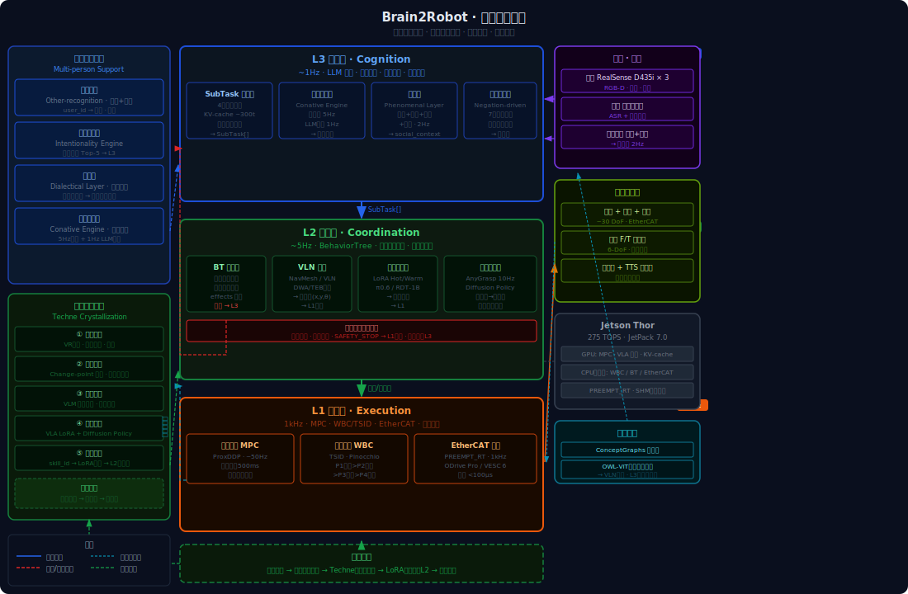

# Brain2Robot · 总纲
**版本** v1.1 · 2026.05

> 如何把一个人蒸馏进机器人里。

---

## 核心命题

人类拥有机器人缺少的三样东西：

**熟悉技能**——做饭、整理、照料，这些技能不在书本里，在身体里。Michael Polanyi 称之为默会知识（tacit knowledge）——无法言说、只能身体力行的能力。

**主动任务能力**——不等人叫，自己判断环境、发现需要、主动行动。空杯子、快到的饭点、主人快回家——人类会综合这些信号主动发起任务，机器人通常不会。

**社交判断**——知道什么时候该说话、什么时候该安静；对不同的人用不同的方式；在家庭的权力结构和情感网络里找到自己的位置。

Brain2Robot 研究如何把这三样东西迁移进机器人——不只是复制行为，而是复制**产生这些行为的判断逻辑**。

---

## 设计哲学

### 一、三层严格分离

```
L3 认知层  ~1 Hz   语言 → 子任务规划 · 主动触发 · 社交理解
L2 协调层  ~5 Hz   子任务调度 · 安全校验 · 导航 · 操作
L1 执行层  ~50 Hz  全身控制 · 力矩输出 · 实时驱动
```

三层时间尺度差一到两个数量级，不能合并进同一个网络。每层只做自己该做的事，通过 SubTask[] 契约传递信息。

### 二、神经-符号混合

神经网络负责理解（L3 VLM、L2 VLA），符号系统负责安全（BehaviorTree 前置条件），优化算法负责实时（WBC、MPC）。三种范式覆盖对方的盲区，不用一个网络包打天下。

### 三、失败驱动重规划

子任务失败时，结构化错误信息注入 L3 提示词，由规划器生成修正子任务——而不是触发硬编码的重试逻辑。失败是信息，不是异常。

### 四、开放词汇优先

场景理解、操作目标、任务语言必须接受任意自然语言输入。封闭类别列表是部署陷阱——家庭环境里总会出现没见过的物体。

---

## 整体架构



---

## 哲学命名规范

模块命名优先借用哲学传统词汇，而非工程缩写。哲学名称作主标题，工程名称作括号注释。

| 工程概念 | 哲学名称 | 词源 |
|---------|---------|------|
| 技能蒸馏管道 | **技艺结晶** Techne Crystallization | Techne（τέχνη）：希腊语身体性知识 |
| 主动触发引擎 | **冲动发生器** Conative Engine | Conation：意志冲动，哲学心理学术语 |
| 偏好推断引擎 | **意向性引擎** Intentionality Engine | Intentionality：布伦塔诺意向性理论 |
| 世界状态监测 | **现象层** Phenomenal Layer | Phenomenal：现象学感知层 |
| 冲突解决层 | **调和层** Dialectical Layer | Dialectic：黑格尔辩证调和 |
| 身份识别融合 | **他者识别** Other-recognition | 他者（Other）：列维纳斯他者哲学 |
| 执行历史记忆 | **痕迹记忆** Trace Memory | Trace：德里达痕迹概念 |
| 失败驱动重规划 | **否定性学习** Negation-driven Replanning | 否定辩证法：从失败中生成新方向 |

新模块命名时，由 Claude 主动提出 1–2 个候选，由 wiki 确认后写入此表。

---

## 模块地图

```
Brain2Robot
│
├── 三层架构（layers/）
│   ├── L3 认知层          任务规划 · 主动触发 · 社交理解 · 偏好接口
│   ├── L2 协调层          BehaviorTree · VLN导航 · 技能执行 · 抓取
│   └── L1 执行层          全身控制 · MPC · EtherCAT驱动
│
└── 横切系统（systems/）
    ├── 多人支持系统        身份识别 · 偏好模型 · 冲突解决 · 触发引擎
    └── 技艺结晶管道        采集 · 分割 · 标注 · 双线蒸馏 · 技能注册
```

---

## 文档导航

| 文档 | 内容 | 状态 |
|------|------|------|
| [本文件](./00_manifesto.md) | 总纲·愿景·架构·导航 | ✅ |
| [L3 认知层](./layers/L3_cognition.md) | 规划器·触发引擎·偏好接口·社交意图·否定性学习 | ✅ |
| [L2 协调层](./layers/L2_coordination.md) | BT调度·符号世界模型·导航·技能执行·抓取·社交响应 | ✅ |
| [L1 执行层](./layers/L1_execution.md) | MPC·全身控制·EtherCAT实时驱动·L1/L2接口契约 | ✅ |
| [多人支持系统](./systems/multi_person_support.md) | 身份·偏好·冲突·触发 | ✅ |
| [技艺结晶](./systems/techne_crystallization.md) | 人类技能蒸馏管道 | ✅ |

---

## 核心数据契约

### SubTask — L3↔L2 边界

```json
{
  "task_id":       "t_00123",
  "type":          "GRASP | NAVIGATE | POUR | PLACE | SPEAK | ...",
  "target_id":     "cup_01",
  "skill":         "grasp_object",
  "params":        { "grasp_type": "side" },
  "preconditions": ["robot.near=cup_01", "robot.hand=empty"],
  "effects":       ["robot.holding=cup_01"]
}
```

### 层间输出约定

| 层 | 输出 | 不输出 |
|----|------|--------|
| L3 | SubTask[] 数组 | 关节角度、路径点 |
| VLN（L2内） | 路径点 (x,y,θ) | 动作动词、指令 |
| VLA（L2内） | 关节轨迹 | 语言规划 |
| L1 | 关节力矩（1kHz） | 任何语义信息 |

---

*最后更新：2026.05*
