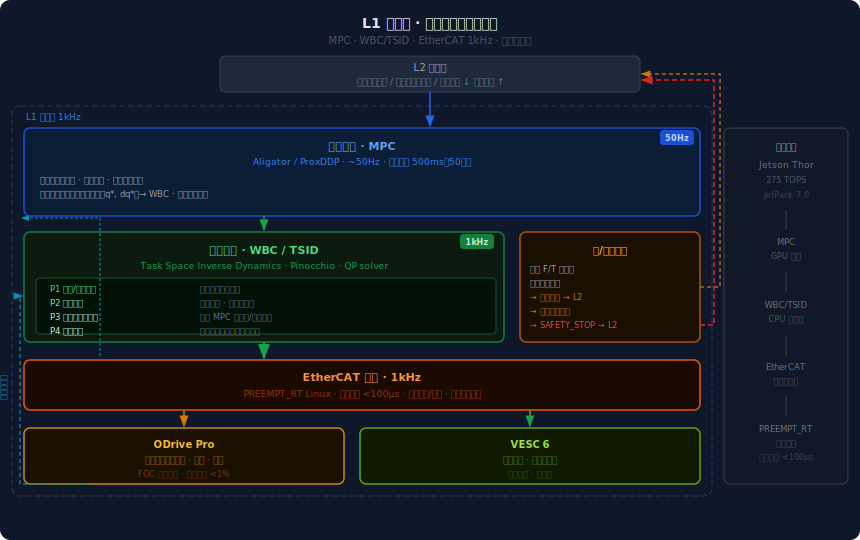

# L1 执行层  ·  Execution Layer
**版本** v0.1 · 2026.05

---

## 职责边界

L1 是机器人的"动"——控制管道运行在 50Hz，力矩输出到达电机的频率为 1kHz，负责：

- 接收 L2 的关节轨迹目标，通过 MPC 优化为动力学可行序列
- 全身控制（WBC）：在多任务优先级约束下求解关节力矩
- 力/触觉反馈闭环：向上层提供接触检测和安全停机信号
- EtherCAT 实时驱动（ODrive Pro / VESC 6）

**L1 不做**：任何语义推理——只处理数字信号。

---

## 架构总览



---

## 控制管道

信号流单向向下：**L2 轨迹目标 → MPC 优化 → WBC 求解 → 力矩输出**，传感器反馈逆向向上形成闭环。

### 1. 轨迹优化（MPC · Aligator/ProxDDP）

L2 技能执行器给出的是末端执行器目标位置，MPC 负责将其转化为**动力学可行的关节目标序列**。

- **频率**：~50Hz
- **预测窗口**：500ms，50 步（每步 10ms）
- **求解器**：ProxDDP（近端动力学微分规划，Aligator 库，GPU 加速）

**约束集合**：

| 约束类型 | 具体内容 |
|---------|---------|
| 关节限位 | 每个关节的位置、速度、力矩上下限 |
| 接触约束 | 支撑脚/手接触点不能产生贯穿力 |
| 末端轨迹 | 末端执行器位置/速度跟踪误差最小化 |

MPC 每周期输出 50 步优化轨迹，取**第一步**执行（滚动时域），下一周期重新优化。这保证了对动态干扰的连续响应。

---

### 2. 全身控制（WBC · TSID via Pinocchio）

接收 MPC 当前步目标，通过任务空间逆动力学（TSID）求解满足多任务优先级的关节力矩 τ。

**任务优先级层级**（严格优先，高优先级先满足，冲突时低优先级任务退让）：

```
P1  重心/平衡约束      双足稳定性，不可妥协
P2  安全约束           关节限位 · 自碰撞回避
P3  末端执行器轨迹     来自 MPC 的位置/速度目标
P4  姿态调节           偏离默认姿态时的回正力矩
```

Pinocchio 计算各任务的雅可比矩阵，QP 求解器在约束空间内求出满足优先级排序的关节力矩向量 τ ∈ ℝⁿ。

WBC 求解频率 50Hz，结果插值到 1kHz 发送给 EtherCAT 驱动层。

---

### 3. 力/触觉反馈闭环

传感器数据服务于两个方向：

**向下闭环**（WBC/MPC 状态更新）：
- 关节编码器 → 实际位置/速度 → MPC 状态更新
- 实际力矩 vs 指令力矩 → 力矩误差 → WBC 修正

**向上信号**（跨层反馈至 L2）：

| 信号 | 触发条件 | L2 用途 |
|------|---------|---------|
| `contact_detected` | 腕部 F/T 传感器超过接触阈值 | 抓取子系统切换 Diffusion Policy |
| `contact_force_N` | 持续力矩数值 | 判断抓握是否稳定 |
| `SAFETY_STOP` | 异常力矩（碰撞/卡滞超过阈值） | L2 停止当前 SubTask，触发安全流程 |

---

### 4. 实时驱动层（EtherCAT + PREEMPT_RT）

**实时内核**：PREEMPT_RT Linux 补丁，保证控制周期抖动 < 100μs，满足 1kHz 硬实时要求。

**EtherCAT 总线（1kHz）**：

```
每周期读取：
  关节编码器位置 q, 速度 dq
  力矩传感器读数 τ_actual
  电机温度

每周期写入：
  力矩设定值 τ_cmd → 电机驱动器
```

**电机驱动器分工**：

| 驱动器 | 负责关节 | 特点 |
|--------|---------|------|
| ODrive Pro | 手臂 · 腰部 · 髋部 | FOC 电流控制，力矩精度 <1% |
| VESC 6 | 底盘轮驱 · 低负载关节 | 开源，可扩展 |

---

## L1/L2 接口契约

通过共享内存（SHM）实现，避免序列化延迟。L2 按 5Hz 写入目标，L1 按 1kHz 读取并插值。

**L2 → L1 输入**：

```json
{
  "joint_trajectory": [
    { "joint_id": "arm_r_0", "q": 0.52, "dq": 0.1, "ddq": 0.0 }
  ],
  "end_effector_target": {
    "frame": "right_hand",
    "position": [0.4, -0.2, 0.9],
    "orientation": [0, 0, 0, 1]
  },
  "contact_state": ["right_foot", "left_foot"]
}
```

**L1 → L2 反馈**：

```json
{
  "contact_detected": true,
  "contact_force_N": 8.2,
  "safety_stop": false,
  "joint_states": {
    "arm_r_0": { "q": 0.521, "dq": 0.098, "tau": 3.2 }
  }
}
```

---

## 参考组件

| 组件 | 规格 |
|------|------|
| 全身控制 | TSID via Pinocchio，QP solver |
| 轨迹优化 | Aligator / ProxDDP，GPU 加速 |
| 实时内核 | PREEMPT_RT Linux，抖动 <100μs |
| 驱动总线 | EtherCAT，1kHz 周期 |
| 电机驱动 | ODrive Pro（高性能关节）/ VESC 6（轮驱） |
| 计算平台 | NVIDIA Jetson Thor 275 TOPS，JetPack 7.0 |
| 腕部传感 | 6-DoF F/T 传感器，接触检测 |
