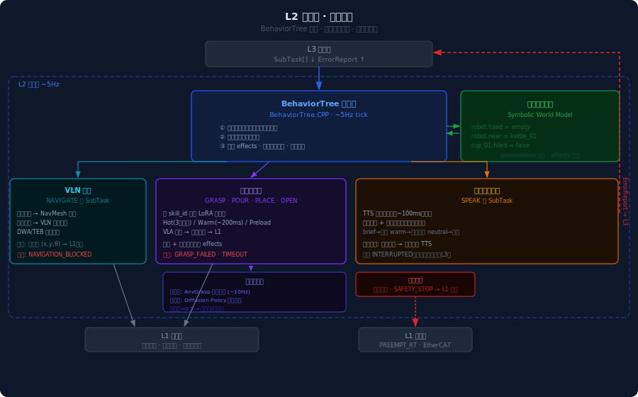

# L2 协调层  ·  Coordination Layer
**版本** v0.1 · 2026.05

---

## 职责边界

L2 是机器人的"做"——以约 5Hz 的频率运行，负责：

- 接收 L3 的 SubTask[]，校验前置条件，调度执行
- 导航：VLN 输出路径点，驱动底盘移动
- 操作：调用 VLA 技能执行器，完成抓取、放置、倾倒等动作
- 安全：实时碰撞检测、人员保护停机
- 失败上报：将结构化错误注回 L3，触发重规划

**L2 不做**：语言推理、任务规划——这属于 L3。
**L2 不做**：关节力矩计算——这属于 L1。

---

## 架构总览



---

## 子模块设计

### 1. BehaviorTree 调度器

L2 的总指挥。每个 SubTask 映射为一棵 BT 子树，以 ~5Hz tick 驱动执行，依赖符号世界模型做前置条件校验。

#### 符号世界模型（Symbolic World Model）

轻量内存键值表，记录当前已知的世界状态谓词：

```
robot.hand         = empty
robot.near         = kettle_01
kettle_01.location = 灶台左侧
cup_01.filled      = false
```

BT 执行前检查 `preconditions[]` 是否全部为真，执行成功后将 `effects[]` 写入。这是符号层的安全网——VLA 可以失败，但 BT 不会在手里已经拿着东西时再去抓另一个物体。

#### 单条 SubTask 执行流

```
Sequence
├── CheckPreconditions(SubTask.preconditions)
│     不满足 → 构造 PRECONDITION_FAILED → 上报 L3
├── DispatchToExecutor(SubTask.type)
│     NAVIGATE          → VLN 导航
│     GRASP/POUR/PLACE  → 技能执行器
│     SPEAK             → 社交响应执行
├── MonitorExecution(timeout=per_skill_type)
│     超时 → 构造 TIMEOUT → 上报 L3
├── VerifyEffects(SubTask.effects)
│     验证失败 → 构造对应错误类型 → 上报 L3
└── UpdateWorldModel(SubTask.effects)
      成功写入谓词，进入下一条 SubTask
```

#### 安全监控（并行运行）

安全检测作为独立 BT 并行节点运行，不依赖主序列：

- 碰撞检测（力矩异常 + 视觉）：触发 `SAFETY_STOP` → 直通 L1 停机，绕过所有逻辑
- 人员接近保护：人员在机械臂半径 1m 内 → 降速或暂停，等待安全距离恢复
- `SAFETY_STOP` 同时上报 L3，由 L3 决定是否继续任务

---

### 2. VLN 导航

处理所有 `NAVIGATE` 类 SubTask，输出路径点序列给 L1 底盘，不输出语言指令或动作动词。

#### 两种导航模式

**已知目标**（目标在 ConceptGraphs 中有位置坐标）：

```
target_id → ConceptGraphs 查询位置 (x,y)
→ NavMesh 全局路径规划
→ DWA/TEB 局部避障
→ 路径点序列 (x,y,θ) → L1 底盘
```

**未知目标**（目标不在场景图中，需要搜索）：

```
target_id（语义描述）→ VLN 模型生成探索方向
→ 边移动边更新 ConceptGraphs
→ 找到目标 → 切换为已知目标模式继续导航
→ 超过搜索预算未找到 → OBJECT_NOT_FOUND
```

#### 到达判定与失败处理

| 条件 | 处理 |
|------|------|
| 距目标 < 0.5m | 到达，SubTask 成功 |
| 路径被阻超过 10s | 等待 5s 重试，仍失败 → `NAVIGATION_BLOCKED` |
| 目标从场景图消失 | 立即上报 `OBJECT_NOT_FOUND` |
| 超出时间预算 | 上报 `TIMEOUT` |

---

### 3. 技能执行器

处理操作类 SubTask（GRASP / POUR / PLACE / OPEN …），核心是按 `skill_id` 动态加载 LoRA 适配器并调用 VLA 策略生成关节轨迹。

#### LoRA 加载策略

| 状态 | 描述 | 延迟 |
|------|------|------|
| **Hot**（热缓存） | 最近 3 个技能保留在 GPU 显存 | ~0ms |
| **Warm**（温加载） | 从 SSD 加载 LoRA 权重到 GPU | ~200ms |
| **Preload**（预加载） | 根据 SubTask 队列预先加载下一个技能 | 并发，无感知延迟 |

**基础模型**：π0.6 或 RDT-1B 作为 backbone，per-skill LoRA 由技艺结晶管道产出，每个技能一个适配器文件。

#### 执行监控

VLA 执行期间，两路反馈并行监控：

- **力矩反馈**（来自 L1）：异常力矩（碰撞、卡滞）→ 立即停止当前动作
- **视觉验证**（执行完毕后）：对比 SubTask.effects 与当前视觉观测，验证目标状态是否达成

超时设定按技能类型：GRASP 10s，POUR 15s，PLACE 8s。

#### 否定约束传递

L3 注入的否定约束（如 `grasp_type=top 禁止`）在技能执行器层作为参数过滤条件传入抓取子系统，直接排除对应候选策略，不需要 VLA 重新踩坑。

---

### 4. 抓取子系统

技能执行器下的专项能力模块。两阶段分工，覆盖接触前的姿态估计和接触时的柔顺控制。

#### 阶段一·接触前（AnyGrasp）

- **输入**：点云 + 目标物体 ID
- **输出**：抓取姿态候选列表（位置 + 朝向 + grasp_type + 置信度）
- **频率**：~10Hz，接近过程中持续更新最优抓点
- **置信度阈值**：< 0.5 触发替代策略

替代策略优先级：
1. 换 grasp_type（top → side → hook）
2. 请求导航调整机器人位置（换角度）
3. 等待遮挡物移开（超时则上报 `GRASP_FAILED`）

否定约束在此层生效：L3 传入的禁止 grasp_type 直接从候选列表过滤。

#### 阶段二·接触时（Diffusion Policy）

力矩传感器检测到接触后接管控制，处理最后几厘米的柔顺操作，对几何方法失效的软体/异形物体有效。基于技艺结晶管道的人类演示数据训练。

#### 接力时序

```
AnyGrasp 估姿（~10Hz）
  → 选定最优抓取姿态（置信度 ≥ 0.5）
  → VLA 规划接近轨迹 → 机械臂接近目标
  → 力矩传感器检测到接触
  → Diffusion Policy 接管 → 完成抓握
  → VerifyEffects（视觉确认）→ 成功
```

---

### 5. 社交响应执行

处理 `SPEAK` 类 SubTask，同步协调语音、面部表情、姿态三路输出。

#### tone → 行为映射

| tone | TTS 韵律 | 面部表情 | 姿态 |
|------|---------|---------|------|
| `brief` | 语速正常，无停顿 | 轻点头 | 轻微前倾 |
| `warm` | 语速略慢，尾音上扬 | 微笑 | 面向用户转体 |
| `neutral` | 标准语速 | 无变化 | 保持当前 |

#### 执行流

```
SubTask(SPEAK, text="水倒好了。", tone="brief")
  → TTS 合成（本地模型，首帧 ~100ms）
  → 并行触发：
      面部表情（brief → 轻微点头）
      姿态协调（L1）：轻微前倾 + 手臂收回
  → 语音播放（与表情/姿态同步）
  → 播放完成 → 恢复待机姿态 → SubTask 成功
```

#### 中断处理

用户在机器人说话时开口 → 立即停止 TTS → 当前 SPEAK SubTask 标记为 `INTERRUPTED`（非失败，不触发 L3 重规划）→ 进入倾听模式，将用户新输入送往 L3。

---

## 参考组件

| 组件 | 规格 |
|------|------|
| BehaviorTree | BehaviorTree.CPP v4，~5Hz tick |
| VLA 基础模型 | π0.6 / RDT-1B，per-skill LoRA |
| 抓取姿态估计 | AnyGrasp（开放词汇，点云输入） |
| 接触操作 | Diffusion Policy（演示数据蒸馏） |
| 局部避障 | DWA / TEB（ROS2 Nav2 兼容） |
| TTS | 轻量本地模型（首帧 <100ms） |
| 安全检测 | 力矩异常检测 + 深度相机人员检测 |
