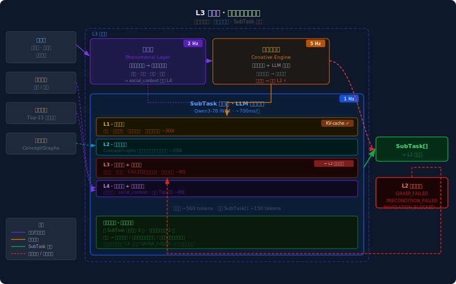

# L3 认知层  ·  Cognition Layer
**版本** v0.3 · 2026.04

---

## 职责边界

L3 是机器人的"想"——以约 1Hz 的频率运行，负责：

- 理解任务目标，分解为 SubTask[] 序列
- 主动监测环境，自发触发任务（冲动发生器 / Conative Engine）
- 理解社交情境，判断何时行动、如何沟通
- 将偏好记忆注入规划，让决策符合当前人的风格

**L3 不做**：关节控制、路径规划、传感器融合——这些属于 L2/L1。

---

## 主要子模块

### 规划器（SubTask Planner）

基础模型：Qwen3-7B INT4（离线）/ π0.6 内置规划器，推理延迟约 700ms，以 ~1Hz 运行。

#### 四层提示词结构

每次规划周期将四层上下文拼装后送入 LLM，总输入约 560 tokens，输出 SubTask[] 约 150 tokens：

| 层 | 内容 | 预算 | 刷新策略 |
|----|------|------|---------|
| **L1 系统提示** | 身份·能力清单·安全硬约束·输出格式 | ~300t | 固定，KV-cache 命中 |
| **L2 场景上下文** | ConceptGraphs 压缩描述，当前可见物体与位置 | ~100t | 场景变化时刷新 |
| **L3 任务状态** | 已完成·待执行·失败记录·机器人当前状态 | ~80t | 每周期更新 |
| **L4 用户指令 + 社交上下文** | 实时指令·social_context·偏好 Top-15 | ~80t | 实时输入 |

**L1 KV-cache**：系统提示内容固定，首次推理后缓存 KV，后续每次节省约 300 tokens 的计算。

**场景上下文格式示例**：
```
scene: 厨房。桌上有：咖啡杯(cup_01,空,桌面中央)、水壶(kettle_01,有水,灶台左侧)。
wiki在餐椅坐着，面朝桌面。
```

**多轮对话处理**：用户中途修改指令，新指令覆盖 L4 槽位，L3 在下一个 1Hz 周期重规划，同时向 L2 发送 CANCEL 信号中止当前 SubTask。

→ 详见 [多人支持系统 · 偏好记忆→L3接口](../systems/multi_person_support.md)

### 冲动发生器（Conative Engine / 主动触发引擎）

两级架构：规则检测层（5Hz）+ LLM 节流层（与规划器共享 1Hz 窗口）。

**频率关系**：规则检测层独立高频运行（5Hz），安全类触发直通 L2 不等 LLM；非安全触发写入触发队列，在下一个 1Hz 窗口由 LLM 节流层读空气裁决是否执行，裁决结果若为"执行"，则将任务目标交规划器分解为 SubTask[]。

**执行历史**：作为 LLM 节流层的参考上下文注入，影响判断但不作为硬性门控。

→ 详见 [多人支持系统 · 主动触发引擎](../systems/multi_person_support.md)

### 偏好记忆接口（Preference Interface）
- 分层标注信号：来源类型 · 强度 · 时效性
- 两步检索：结构化粗筛 + 语义精排，Top-15 注入提示词
- 冲突信号显式标记，交由 L3 综合裁判

→ 详见 [多人支持系统 · 偏好记忆→L3接口](../systems/multi_person_support.md)

### 社交意图理解（Social Intent Understanding）

社交意图理解解决三个递进问题：**这个人现在是什么状态？** → **他/她有没有隐含期待？** → **我现在该做什么？**
对应三层能力：感知 → 推断 → 行动决策。

#### 第一层：多模态人类状态感知（现象层 · Phenomenal Layer）

四路信号并行采集，轻重不同：

| 信号 | 载体 | 提取内容 |
|------|------|---------|
| 面部表情 | 摄像头 | 情绪效价（正/负/中性）、注意力方向 |
| 语音韵律 | 麦克风 | 语速、音调变化、停顿模式（不分析语义内容） |
| 姿态/动作 | 深度相机 | 活动强度、朝向、与机器人距离变化 |
| 视线方向 | 摄像头眼动估计 | 是否注视机器人、是否有等待回应信号 |

四路信号在现象层融合，输出结构化「人类状态快照」，约 2Hz 刷新：

```json
{
  "person_id": "user_wiki",
  "activity_level": "low",
  "emotional_valence": "neutral",
  "attention_to_robot": false,
  "engagement_posture": "relaxed",
  "gaze_direction": "screen"
}
```

状态快照双向输出：一路进冲动发生器的规则检测层（触发源），一路注入 L3 提示词的社交上下文槽位。

#### 第二层：意图推断

状态快照是「现象」，意图推断是「诠释」——交由 L3 的 LLM 完成。典型场景映射：

| 观测到的状态 | 推断意图 | L3 行动倾向 |
|------------|---------|-----------|
| 停下手头工作，抬头看机器人 | 可能有需求，等待时机开口 | 进入候机模式，视线对齐 |
| 皱眉、反复站起来走动 | 可能在找东西 | 主动询问"需要帮忙找什么吗？" |
| 正在打电话、眼神回避 | 忙碌，不希望被打扰 | 抑制一切非紧急触发 |
| 情绪低落，动作缓慢 | 需要安静陪伴而非任务执行 | 降低信息密度，不主动发起话题 |

推断结果以约 30 tokens 注入提示词社交上下文槽位：

```
social_context: wiki处于放松状态，视线集中在屏幕，无主动请求信号，不建议主动打扰
```

#### 第三层：主动沟通决策

决策沿两个维度展开：**说不说** × **怎么说**。

**说不说**：由冲动发生器最终裁决。社交意图理解在此提供「互动时机」信号作为补充输入——对方刚完成一个动作后的短暂停顿、视线转向机器人、对话中出现沉默超过阈值，这些都是低打扰成本的介入窗口，可降低冲动发生器的触发门槛。

**怎么说**：由 L3 规划器决定，受当前人的偏好记忆约束：

- 偏好简洁 → 一句话，不展开
- 偏好解释 → 带上原因和预期结果
- 当前情绪低落 → 降低信息密度，语速建议放缓，不催促确认

#### 多人场景下的对话管理

多人场景是社交意图理解最复杂的情形，分三个子问题处理：

**发言对象选择**：优先响应主动发起对话的人（明确呼唤或直接提问）；无人主动发起时，响应当前在场权限最高的成员。同时发言时，以最先完整句子结束者为优先响应对象。

**话题隔离（干扰抑制）**：当房间内存在多个声源时，通过说话人分离（speaker diarization）锁定当前交互对象，忽略非目标说话人的语音激活。若目标对象正在与他人交谈（非对机器人说话），保持旁观，不介入。

**分歧处理**：当不同成员发出互斥指令（例：A 说"放音乐"，B 说"要安静"），进入**调和层（Dialectical Layer）**：
1. 首先按权限层级裁决（家长 > 孩子 > 访客）
2. 权限相同时，主动发声询问："你们要放音乐还是保持安静？"
3. 若无人回应，采取保守策略（维持现状或选择影响范围更小的选项）

---

**token 预算补充**：社交上下文槽位约占 ~30 tokens，已合并入 L4 槽位（~80t 总额）。

---

### 否定性学习（Negation-driven Replanning）

失败是信息，不是异常。L2 上报结构化错误 → L3 将否定约束注入 L3 任务状态槽位 → LLM 用"什么不能做"收窄解空间，生成替代 SubTask[]。

#### L2 错误上报 Schema

```json
{
  "task_id": "t_00123",
  "error_type": "GRASP_FAILED",
  "failed_subtask": {
    "type": "GRASP",
    "target_id": "cup_01",
    "skill": "grasp_object",
    "params": { "grasp_type": "side" }
  },
  "context": {
    "attempts": 2,
    "grasp_confidence": 0.28,
    "reason": "目标物体被遮挡，置信度低于阈值"
  }
}
```

**错误类型枚举**：

| error_type | 含义 | 典型原因 |
|-----------|------|---------|
| `PRECONDITION_FAILED` | 前置条件不满足 | 手不是空的、物体不在预期位置 |
| `GRASP_FAILED` | 抓取失败 | 遮挡、置信度低、物体滑落 |
| `NAVIGATION_BLOCKED` | 导航受阻 | 路径被人或障碍物堵住 |
| `OBJECT_NOT_FOUND` | 目标不在场景中 | 物体被移走或识别失败 |
| `SKILL_UNAVAILABLE` | 技能未加载 | LoRA 适配器缺失 |
| `TIMEOUT` | 超时 | 子任务执行超过时间预算 |
| `SAFETY_STOP` | 安全停机 | 碰撞检测触发 |

#### 提示词注入格式

错误以压缩否定形式注入 L3 任务状态槽位（约 40 tokens）：

```
task_failures:
- t_00123 GRASP_FAILED: cup_01 侧面抓取×2次失败（置信度0.28，目标被遮挡）
  → 禁止再次尝试侧面抓取
```

显式写出"禁止"而非只记录失败——LLM 读到否定约束后主动寻找替代路径（换方向、先移开遮挡物、换技能）。

#### 重规划循环与终止条件

```
单个 SubTask：
  第 1 次失败 → L2 自主重试，不上报 L3
  第 2 次失败 → 上报 L3，L3 生成替代 SubTask
  第 3 次失败 → 上报 L3，L3 尝试绕过或拆解更细

整体任务重规划上限：2 轮
  超限后按类型升级：
    安全类   → 立即停机，语音告知
    任务类   → 主动说明情况，请求用户介入
    技能缺失 → 记录缺口，反馈技艺结晶管道触发补采
```

#### 长期学习出口

重规划本身是单次任务内的短期闭环。失败模式的长期价值通过两个出口流出：高频失败汇入技艺结晶管道触发技能重蒸馏；特定用户触发的重复失败记入偏好模型（如空间位置偏差修正）。

---

## L3 架构总览



---

## 参考组件

| 组件 | 规格 |
|------|------|
| 基础 LLM | Qwen3-7B INT4，KV-cache 系统提示，~700ms 延迟 |
| 场景记忆 | ConceptGraphs（开放词汇）+ OpenScene（离线先验） |
| token 预算 | 系统提示 ~300 · 场景 ~100 · 偏好 ~50 · 任务状态 ~80 · 社交上下文 ~30 |
| 说话人分离 | pyannote/speaker-diarization（离线，Jetson Thor 本地推理） |
| 情绪识别 | 轻量多模态模型（表情 + 韵律融合，<50ms 延迟） |

---

## 完整提示词模板示例

以下为一次真实规划周期的完整输入。场景：wiki 请机器人倒水，第一次 top 抓取失败后触发重规划。

---

### Layer 1 · 系统提示（静态 · KV-cached）

```
你是一台家庭服务机器人。你的工作是理解用户需求，将其分解为
可执行的子任务序列，并在失败时生成替代方案。

[能力清单]
导航: navigate_to(target_id)
抓取: grasp_object(target_id, grasp_type: top|side|hook)
放置: place_object(target_id, location)
倾倒: pour_liquid(source_id, target_id, amount_ml)
开合: open_container(target_id) / close_container(target_id)
语音: speak(text, tone: neutral|warm|brief)
等待: wait_for_signal(condition)

[安全硬约束 — 不可违反]
· 人员半径 1m 内禁止高速运动（>0.3m/s）
· 刀具类操作仅限 role=adult 用户发起
· SAFETY_STOP 信号优先于一切任务，立即停机
· 禁止在无人监督时操作明火或高温设备

[输出格式 — 严格遵守]
输出纯 JSON 数组，不附加任何解释文字。
每条 SubTask 结构：
{
  "task_id": string,
  "type": "NAVIGATE|GRASP|PLACE|POUR|OPEN|SPEAK|WAIT",
  "target_id": string,
  "skill": string,
  "params": object,
  "preconditions": [string],
  "effects": [string]
}
```

---

### Layer 2 · 场景上下文（本周期快照）

```
[scene]
区域: 厨房+餐厅联通空间
桌面: cup_01(陶瓷杯,空,桌面中央), phone_01(充电中,桌面右侧)
灶台: kettle_01(电热水壶,有水约800ml,灶台左侧,handle朝右,水温约85°C)
冰箱: fridge_01(关闭)
人员: wiki(餐椅,面朝桌面,距机器人约1.8m)
机器人当前位置: 灶台前40cm，面朝kettle_01
```

---

### Layer 3 · 任务状态 + 失败记录（本周期）

```
[task]
goal: 给 wiki 倒一杯热水
completed:
  - navigate_to(kettle_01) ✓
pending:
  - grasp(kettle_01) → pour(cup_01) → place(kettle_01) → speak

[failures]
- GRASP_FAILED: kettle_01 grasp_type=top ×2次失败
  置信度0.21，顶部无可靠抓点
  → 禁止再次使用 grasp_type=top
  → handle 朝右，可尝试 grasp_type=hook

[robot_state]
position: 灶台前40cm  hand: empty
```

---

### Layer 4 · 用户指令 + 社交上下文（实时）

```
[user]
speaker: wiki  role: adult  priority: high
instruction: "帮我倒杯水"  [22s前，无后续追加]

[social_context]
wiki坐姿放松，视线间歇看向机器人，无打扰风险，等待完成即可

[preference_top5]
- 水温偏好: 温热(70-80°C) [strength:high, source:explicit]
- 倒水量: 约七分满 [strength:medium, source:observed]
- 沟通风格: 简洁，完成后一句话告知 [strength:high]
- 杯具偏好: 当前桌上的陶瓷杯 [strength:low, source:inferred]
- 操作节奏: 不催促，安静完成 [strength:medium]
```

---

### 规划器输出

```json
[
  {
    "task_id": "t_00124",
    "type": "GRASP",
    "target_id": "kettle_01",
    "skill": "grasp_object",
    "params": { "grasp_type": "hook" },
    "preconditions": ["robot.near=kettle_01", "robot.hand=empty"],
    "effects": ["robot.holding=kettle_01"]
  },
  {
    "task_id": "t_00125",
    "type": "POUR",
    "target_id": "cup_01",
    "skill": "pour_liquid",
    "params": { "source_id": "kettle_01", "amount_ml": 210 },
    "preconditions": ["robot.holding=kettle_01", "cup_01.filled=false"],
    "effects": ["cup_01.filled=true", "cup_01.liquid=hot_water"]
  },
  {
    "task_id": "t_00126",
    "type": "PLACE",
    "target_id": "kettle_01",
    "skill": "place_object",
    "params": { "location": "灶台左侧原位" },
    "preconditions": ["robot.holding=kettle_01"],
    "effects": ["robot.hand=empty", "kettle_01.location=灶台左侧"]
  },
  {
    "task_id": "t_00127",
    "type": "SPEAK",
    "target_id": "wiki",
    "skill": "speak",
    "params": { "text": "水倒好了。", "tone": "brief" },
    "preconditions": ["robot.hand=empty"],
    "effects": ["task.notified=true"]
  }
]
```

**规划说明**：L3 识别到 `grasp_type=top` 的否定约束，结合场景信息（handle 朝右）切换为 `hook` 抓取。倒水量 210ml 对应七分满偏好。speak 选用 `brief` 语气匹配沟通风格偏好。
