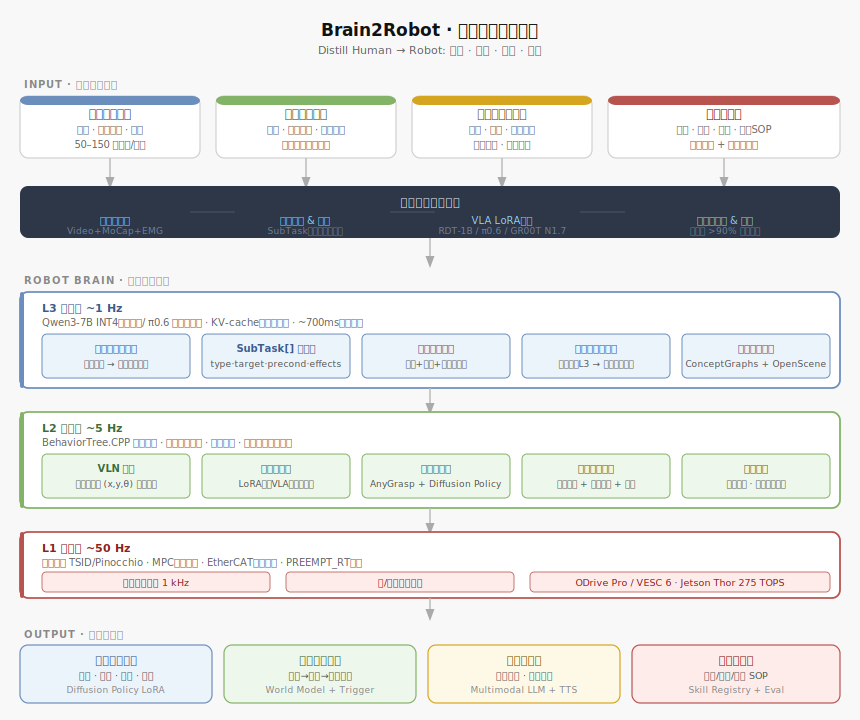
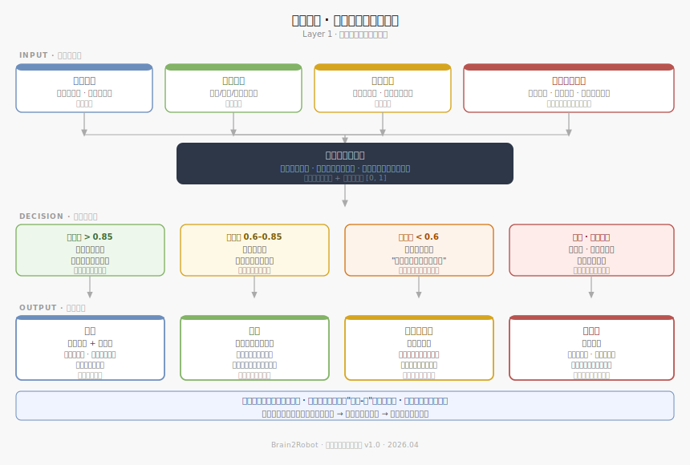
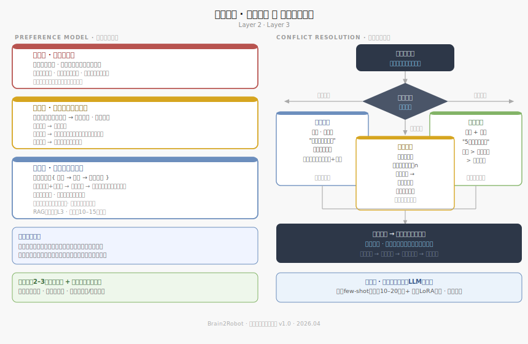
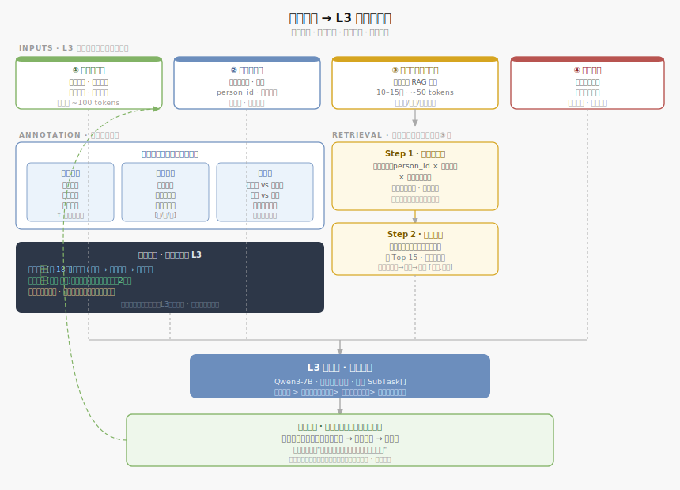
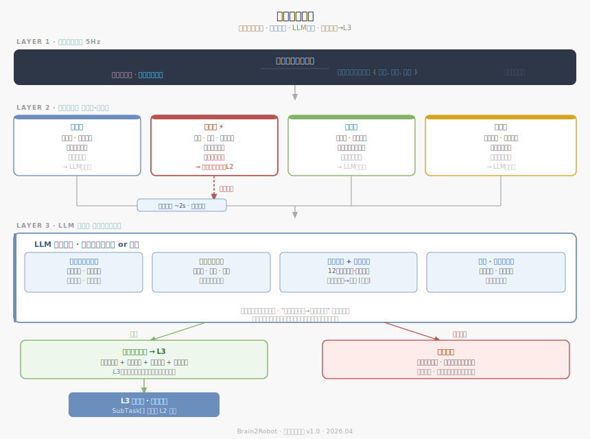

# Brain2Robot · 多人支持系统设计文档
**版本** v1.0 · 2026.04  
**模块** 身份识别层 / 偏好模型层 / 冲突解决层

---

## 总体架构



---

## 概述

多人家庭支持是 Brain2Robot 区别于单用户服务机器人的核心能力。系统需要在不要求人配合的自然条件下，识别每个家庭成员的身份，维护各自独立的偏好档案，并在多人偏好或指令冲突时做出合理决策。

整个系统分三层：**身份识别层 → 偏好模型层 → 冲突解决层**，每层解决一个独立问题，层间通过标准接口传递结论。

---

## 第一层：身份识别



### 设计原则

家庭环境中人不会主动配合识别，机器人必须在自然状态下完成身份判断。单模态方案在背对、遮挡、逆光等场景下必然失败，须采用多信号融合架构。

### 四种输入信号

| 信号 | 优势场景 | 弱点 | 权重策略 |
|------|----------|------|----------|
| 人脸 | 正脸、光线好 | 遮挡、逆光、相似面孔 | 高置信时主导 |
| 步态 | 背对、远距、侧身 | 换鞋、受伤后临时变化 | 人脸失效时接替 |
| 声纹 | 开口即采集 | 感冒时声音变化 | 与其他信号交叉验证 |
| 时空行为模式 | 任何时候 | 不能单独决策 | 始终作为先验概率 |

### 融合与置信度分支

融合引擎输出一个 [0, 1] 的置信度分数，根据分数进入不同处理路径：

- **> 0.85**：直接确认身份，进入权限判断
- **0.6 ~ 0.85**：带标记执行，持续采集等待收敛
- **< 0.6**：主动自然确认（用个性化问题间接确认，而非直接问"你是谁"）
- **未知**：保守模式

### 保守模式定义

对未识别成员（访客、陌生人）执行以下约束：

- **不主动触发**任何服务
- **不采集偏好数据**，不建立长期档案
- **不使用个性化信息**，响应保持中性通用
- **响应显式呼叫**后，服务须经家庭成员授权

### 权限层级

```
家长
├── 完整权限 + 覆盖权
├── 可授权新成员
├── 可中止任何人发起的任务
└── 可制定家庭层规则

孩子
├── 执行权（可发起服务指令）
├── 可授权访客基础服务
├── 执行后广播通知家长
└── 家长可打断或拒绝（打断 vs 拒绝处理不同）

已授权访客
├── 基础服务权（仅对自身）
└── 授权来自家庭成员，不来自访客自身

陌生人
└── 保守模式（升级需家长显式声明）
```

**关于孩子授权访客**：孩子有权授权访客基础服务，家长可打断或拒绝。打断（任务进行中）立即停止并告知孩子；拒绝（执行前）需向孩子解释原因，不能沉默忽视。

**并发冲突处理**：两人同时发出矛盾指令时，暂停并透明化，分别确认，不自行裁决。

### 物体归属

通过历史行为频率推断"物体—人"软归属关系，形式为概率分布而非硬绑定。触发行动前先查归属，再找对应成员的偏好档案。

---

## 第二层：偏好模型 与 第三层：冲突解决



### 三层结构（优先级从高到低）

#### 家庭层（最高优先级）

- **定义**：全家共同认可的行为规范
- **来源**：必须显式声明，不可从行为推断
- **示例**：深夜不发噪音、访客时保持距离、孩子零食柜不代开
- **特性**：任何成员的个人偏好都不能覆盖此层

#### 关系层

- **定义**：成员之间的服务规则（服务发起者 × 服务对象 → 约束）
- **来源**：显式声明
- **示例**：孩子的杯子空了，先查家长是否要求孩子自己倒（锻炼自理）
- **特性**：同一服务，对象不同，策略不同

#### 个人层

- **核心单元**：`{ 情境 → 行为 → 期望反应 }`（三元组，非扁平标签）
- **示例**：`{工作中、高专注} → {主动倒水} → {接受，但不说话，放下就走}`
- **特性**：情境越丰富，判断越准；每人独立档案，互不干扰

### 长期记忆存储

**双层架构**：

| 层级 | 内容 | 更新策略 |
|------|------|----------|
| 情节层 | 原始交互日志（事实） | 只增不删，永久保留 |
| 语义层 | 提炼的偏好模型（结论） | 时间衰减权重，非覆盖删除 |

**关键原则**：
- **本地优先**：隐私数据不默认上云，断网可用
- **时间衰减**：旧记录权重随时间降低，但不删除
- **显式优先**：用户主动声明的偏好立即生效，权重远高于行为推断，不参与衰减
- **用户控制**：可查看和删除自己的记录；删除后语义层对应权重同步调整
- **RAG检索**：L3调用时按场景相关性召回10–15条偏好注入提示词（约50 tokens）

### 冷启动策略

1. 注册时通过2–3个关键问题快速建立基础偏好轮廓（自然问法，非调查问卷）
2. 从相似成员（年龄、作息、角色相近）迁移初始权重，加速修正

---

## 第三层：冲突解决

### 三类冲突及处理策略

#### 指令冲突（两人同时发出矛盾指令）

**策略**：暂停 + 透明化，不自行裁决

- 分别确认双方："我同时收到两个任务，先做哪个？"
- 两人都不在场时：按权限层级执行，同时通知另一方
- 不能沉默地忽视任何一方

#### 偏好冲突（主动触发时两方偏好互相矛盾）

**策略**：取保守交集，不主动触发

- 两方偏好允许的行为取交集
- 交集为空 → 不主动触发，等待显式指令
- 原则：宁可少做，不做错
- 长期效果：机器人反复不触发 → 成员主动声明规则 → 转为显式偏好

#### 资源冲突（机器人同时被需要）

**策略**：排队 + 透明告知等待

- 等待方必须知道：自己在队列里 + 大概等待时长
- 默认优先级：`安全紧急 > 显式呼叫 > 主动触发`，同类按时间先后
- 家庭层规则可覆盖默认优先级

### 反复冲突的上升机制

若同一对成员在同类情境下反复出现冲突，系统识别该模式，并在平静时机主动提出：

> "我注意到吃饭时我经常不知道该听谁的，你们要不要给我一个统一的规则？"

将临时冲突转化为家庭层显式规则，从根本上解决，而非每次临场应对。

### 读空气能力（节流层）

- **判断主体**：LLM（非规则硬编码），使机器人具备"知道什么时候不该出手"的能力
- **学习机制**：
  - 短期：动态 few-shot（近期10–20条高置信经验注入提示词）
  - 长期：LoRA 微调（积累数百条后，将社交风格烧进模型权重）
- **两层叠加**：长期微调捕捉稳定性格偏好，短期 few-shot 捕捉近期状态漂移

---

## 接口约定

### 身份识别层输出

```json
{
  "person_id": "dad_01",
  "confidence": 0.92,
  "mode": "confirmed",       // confirmed | tentative | low_conf | unknown
  "permission_level": "parent",  // parent | child | guest | stranger
  "signals_used": ["face", "voice"]
}
```

### 偏好查询接口

```
query(person_id, context_snapshot) → List[PreferenceTuple]
// 返回与当前情境最相关的10–15条偏好三元组
```

### 冲突检测触发条件

- 同一时间窗口（< 3s）收到两条目标不兼容的指令
- 主动触发决策时，两个以上成员的偏好档案返回矛盾结论
- 当前执行队列已满，新请求到达

---

## 第四层：偏好记忆 → L3 认知层接口



### 核心问题

L3 每次调用都是无状态的——所有"记忆"必须在每次调用时主动注入提示词。偏好系统与 L3 之间的接口本质上是一个**信息压缩与检索问题**：偏好库里可能有数百条记录，每次只能注入数十个 token，必须保证注入的是最有价值的内容。

### L3 每次调用的四类输入

| 输入 | 来源 | Token 预算 | 刷新频率 |
|------|------|-----------|---------|
| ① 场景上下文 | 实时感知 | ~100 tokens | 每次调用 |
| ② 身份与权限 | 识别层输出 | ~20 tokens | 每次调用 |
| ③ 偏好记忆 | 偏好库检索 | ~50 tokens | 每次调用 |
| ④ 任务状态 | 执行历史 | ~80 tokens | 重规划时注入 |

### 偏好检索：两步走

**第一步·结构化粗筛**：按 `person_id × 情境类型 × 触发行为类型` 三维字段精确匹配，过滤掉不相关的记录。三维同时匹配的目的是避免语义相似但含义相反的记录被误召回（"工作时需要帮助"和"工作时不想被打扰"在向量空间里很接近）。

**第二步·语义精排**：在粗筛结果里做语义相似度排序，取 Top-15，压缩序列化注入提示词。

压缩格式每条约 15–20 tokens：
```
工作+专注 → 倒水 → 接受(放下勿言) [18次,强]
```

### 信号分层标注

每条注入信息携带三个标签，让 L3 能像法官看证据一样权衡：

**来源类型**（可信度递增）：实时观察 → 历史偏好 → 显式声明

**信号强度**：反馈次数 + 一致性程度 + 观察清晰度，标记为 [弱/中/强]

**时效性**：几秒前的实时观察 vs 几个月前的历史偏好，近期异常期间的记录加特殊标记

### 冲突信号显式标记

当实时观察与历史偏好方向相反时，**不让 L3 自己去发现矛盾**，而是在提示词里显式标记冲突区块：

```
<conflict_signal>
  历史偏好 [强·18次]: 工作+专注时 → 主动服务 → 偏向拒绝
  实时观察 [清晰·此刻]: 反复拿起空杯子查看，已持续2分钟
  信号方向: 相反
  请综合判断本次是否主动服务
</conflict_signal>
```

L3 综合判断的默认优先级：**显式声明 > 实时观察（清晰）> 历史偏好（强）> 历史偏好（弱）**

但 L3 可以根据情境打破这个默认顺序——这正是交给它判断的价值所在。

### 结果反哺：记录判断过程，不只是结果

每次 L3 决策执行后，反哺记录必须包含**判断过程**，不只是行为结果：

```
{
  "conflict_type": "observation_vs_history",
  "winning_signal": "realtime_observation",
  "action": "主动倒水",
  "feedback": "accepted",
  "meta_rule_candidate": "身体语言信号清晰时可覆盖历史偏好"
}
```

这类记录积累后，提炼出**元规律**——关于"在什么条件下哪类信号更可信"的更高层规律，逐步迁移进语义层和 LoRA 微调数据集。

### 防止判断漂移：异常检测

短期内反馈模式出现明显偏移（如某周全家连续拒绝主动服务），不立即更新 L3 判断倾向，先标记为"近期异常"。持续超过阈值时间才确认为真实偏好变化，防止临时状态污染长期模型。

---

## 待决策项

- [ ] 儿童权限细分（不同年龄段的权限边界）
- [ ] 跨设备偏好同步的加密方案
- [ ] 家庭成员离家/回家的档案切换逻辑
- [ ] 陌生人临时授权的有效期设计

---

---

## 第五层：主动触发引擎



### 设计目标

让机器人从"等人叫"变成"自己想"。采用两级架构：规则检测层（轻量实时）发现状态变化，LLM 节流层（读空气）决定是否行动。规则解决"看什么"，LLM 解决"做不做"。

### 第一级：世界状态监测（5Hz）

差分引擎持续对比相邻两帧世界快照，提取**有意义的状态跳变**。判断"有意义"依据的是变化的**语义类别**，而非物理量大小——椅子位移 3cm 不触发，杯子从满变空触发。

输出格式：变化事件流 `{ 对象, 属性, 变化方向 }`

### 第二级：规则检测层

规则按需求类型分四组，而非按物体分类。每条规则结构：`{ 监测对象, 触发条件, 需求类型, 初始优先级 }`

| 类型 | 示例 | 优先级 | 后续路径 |
|------|------|--------|---------|
| 补给类 | 容器空、耗材不足 | 中 | → LLM 节流层 |
| 安全类 | 跌倒、危险接近、门未关 | 最高 | → **直通 L2**，跳过节流 |
| 服务类 | 人靠近、呼唤名字、任务完成待接 | 中高 | → LLM 节流层 |
| 环境类 | 时间触发、天气变化、设备完成 | 低中 | → LLM 节流层 |

规则库可扩展，新场景加新规则，不改底层逻辑。

**触发合并窗口**：约 2 秒内收集所有触发事件，合并去重后作为整体送入节流层。LLM 一次性判断"这组情境下最值得做的一件事"，而非对每个触发单独判断——让 LLM 看到完整情境，判断质量更高。

### 第三级：LLM 节流层

节流层输入四类信息，LLM 综合判断，输出二元结论：**行动** or **等待**。

**输入 ①** 合并触发事件组：需求类型、涉及人物、触发强度、发生时间

**输入 ②** 人物当前状态：专注度、情绪、姿态——多模态氛围感知

**输入 ③** 偏好记忆 + 执行历史：
```
近期执行记录（有衰减权重）：
  12分钟前 → 倒水(cup_01) → 人喝了约一半
  昨天同时段 → 倒水(cup_01) → 人一口未喝
```
执行历史作为**参考而非硬性约束**，让 LLM 判断"今天状态和以往是否不同"——区分"需求满足了"和"需求被忽视了"两种截然不同的含义。

**输入 ④** 时间与环境上下文：当前时段、家庭规范、其他成员状态

**等待路径**：判断为等待时，触发事件进入等待队列，定期重新评估；条件变化时重入节流；超时丢弃；人自行处理后标记为负反馈信号。

**节流结果也反哺偏好库**："触发了但选择等待，人随后自行处理"本身是一条有效信号——说明该情境下主动行动可能不必要，触发阈值随之上调。

### 触发 → L3 信息打包

节流层判断"行动"后，打包以下内容交给 L3：

```
{
  "trigger_events": [...],       // 合并后的触发事件组
  "inferred_need": "补充饮水",   // 推断的需求类型
  "target_person": "dad_01",    // 涉及人物
  "world_snapshot": {...},       // 当前世界快照
  "mode": "proactive"           // 区别于被动响应
}
```

L3 此时角色是**主动决策者**，而非指令分解者——先判断"这个情境下最合理的行动是什么"，再分解为 SubTask[] 输出给 L2。

### 执行历史的学习闭环

| 执行结果 | 信号含义 | 后续影响 |
|---------|---------|---------|
| 倒水 → 快速喝完再次空 | 需求旺盛 | 同类触发阈值降低，更积极响应 |
| 倒水 → 一口未喝 | 需求不真实 | 同类触发阈值升高，节流更保守 |
| 触发等待 → 人自处理 | 不需要主动介入 | 该情境触发优先级下调 |

---

*下一模块：技能蒸馏管道（人类示教采集 → 自动标注 → VLA 微调 → 技能库注册）*
