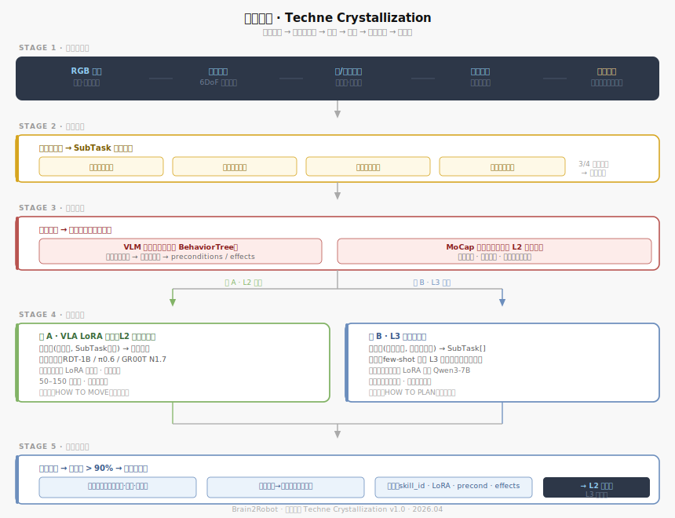

# 技艺结晶  ·  Techne Crystallization
**版本** v1.0 · 2026.04  
**模块** 人类技能蒸馏管道

---

## 命名由来

Techne（τέχνη）是希腊哲学中的"身体性知识"——无法言说、只能身体力行的技能，对应 Michael Polanyi 的 tacit knowledge（默会知识）。结晶（Crystallization）强调从流动的人类经验凝固为精确可复用结构的过程。

本模块解决的核心问题：**把人类的默会知识迁移进机器人**，使机器人能执行人类示教过的技能，并理解人类的任务拆解方式。

---

## 总体架构



---

## 管道全貌

```
人类演示
  ↓ 阶段一：多模态采集（视频·MoCap·力感·眼动 → 毫秒级同步）
  ↓ 阶段二：演示分割（多信号投票 → SubTask 边界）
  ↓ 阶段三：自动标注（VLM抽谓词 + MoCap抽参数）
  ↓ 阶段四：双线蒸馏
       线A → (视觉帧, SubTask) → 关节轨迹  →  VLA LoRA 微调（L2执行）
       线B → (任务目标, 场景) → SubTask[]  →  L3 规划器蒸馏
  ↓ 阶段五：评估（>90%成功率）→ 技能库注册 → L3可调用
```

---

## 阶段一：多模态采集

人类执行任务时同步录制六路数据：

| 数据类型 | 内容 | 用途 |
|---------|------|------|
| RGB 视频（双视角） | 第一·第三视角全程 | VLM 标注 · L2 视觉输入 |
| 动作捕捉 | 手腕·手指 6DoF 轨迹 | 关节轨迹提取 |
| 力/触觉传感 | 抓握力·接触点分布 | 触觉参数·分割信号 |
| 眼动追踪 | 注意力序列 | 意图线索·分割信号 |
| 思维发声（可选） | 操作时口述 | 语义锚点·辅助标注 |

**关键设计**：硬件触发信号做主时钟，六路数据锁定到同一毫秒级时间戳。数据对齐精度直接影响后续所有处理质量。

---

## 阶段二：演示分割

将连续动作流切割为离散 SubTask 片段。不依赖单一信号，采用**多信号投票**机制：

- 动作速度骤降（子动作完成的典型特征）
- 物体状态跳变（杯子被拿起、盖子打开）
- 眼动焦点切换（注意力转移先于动作转移）
- 力传感器归零（手放开物体）

四路信号中三路同时指向同一时间点，确认为 SubTask 边界。

**输出**：SubTask 片段序列，每段包含起止时间戳、涉及物体、动作类型初步标签。

---

## 阶段三：自动标注

从 SubTask 片段中自动提取两类结构化信息：

**符号谓词**（供 BehaviorTree 使用）：
- VLM 逐帧理解场景语义
- 前后帧差分提取状态变化
- 转化为符号形式：`cup.filled=True`、`robot.holding=kettle`
- 形成每个 SubTask 的 `preconditions` 和 `effects` 字段

**技能参数**（供 L2 执行器使用）：
- 直接从 MoCap 数据提取
- 抓握类型（顶部/侧面/捏取）、力度范围、轨迹关键路径点

人工审核仅介入置信度低于阈值的片段，不做全量人工标注。

**输出**：带完整结构化标注的演示数据集，可直接用于阶段四双线蒸馏。

---

## 阶段四：双线蒸馏

同一份标注数据集同时服务两条蒸馏线，目标层次不同。

### 线 A · VLA LoRA 微调（L2 执行技能）

**目标**：学习 HOW TO MOVE——给定 SubTask 类型，物理上怎么执行。

- 输入：`(视觉帧, SubTask类型)` → 输出：`关节轨迹`
- 基础模型：RDT-1B（国内可用·轻量）/ π0.6（真实家庭验证）/ GR00T N1.7
- 每个技能独立一个 LoRA 适配器，按需加载，互不干扰
- 50–150 次演示，训练时间数小时量级

### 线 B · L3 规划器蒸馏

**目标**：学习 HOW TO PLAN——给定任务目标，怎么拆解为 SubTask 序列。

- 输入：`(任务目标, 场景上下文)` → 输出：`SubTask[]`
- **短期**（即时生效）：作为 few-shot 示例注入 L3 提示词，让 L3 参考人类的分解策略
- **长期**（积累后微调）：规模足够后对 Qwen3-7B 做 LoRA 微调，把任务拆解风格烧进权重

线 B 蒸馏的不只是"怎么拆任务"，更是"这个人倾向于怎么组织任务"——先整理再服务，还是边做边整理。这些风格被蒸馏进 L3 后，机器人的任务节奏会越来越像这个家庭的方式。

**两线关系**：线 A 是必须做的（没有执行技能机器人动不了）；线 B 是逐步积累的（前期 few-shot 够用，数据量上来再微调）。

---

## 阶段五：评估与注册

### 泛化测试

测试条件刻意引入变化，专门测泛化能力而非记忆能力：

- 不同物体外观（颜色·形状·材质变化）
- 不同初始位置（随机摆放）
- 不同光线条件（明暗·角度）

成功率 **> 90%** 方可注册进技能库。失败案例全部保留，作为下一轮补充采集的方向指引。

### 注册格式

```json
{
  "skill_id": "pour_water",
  "display_name": "倒水",
  "lora_adapter": "pour_water_v2.safetensors",
  "base_model": "rdt-1b",
  "preconditions": ["robot.holding=source", "dest.reachable=True"],
  "effects": ["dest.filled=True"],
  "success_rate": 0.94,
  "demo_count": 87,
  "test_conditions": { "objects_tested": 12, "positions_tested": 20 }
}
```

L3 规划时按 `skill_id` 引用，L2 收到 SubTask 后按 `skill_id` 加载对应 LoRA 执行。

---

## 三个核心挑战（待深入）

1. **分割精度**：多信号投票在动作高度连续或速度均匀的技能（如搅拌）上的表现——需要专项设计
2. **自动标注质量**：VLM 抽取符号谓词的准确率，以及如何设计人工审核的介入阈值
3. **泛化 vs. 过拟合**：50 次演示的泛化边界在哪里，以及什么类型的技能需要更多示教

---

*下一模块：社交意图理解（多模态人类状态感知 · 意图推断 · 主动沟通）*
